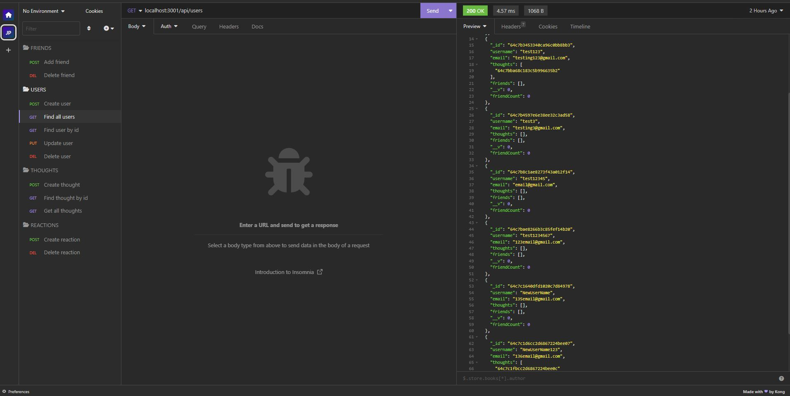

# social-network-api
Backend API for Social Network


## Description
Main Topic: Express.js, Mongoose and MongoDB

API built to allow for CRUD of Users, Friends list, Thoughts (social network posting) and Reactions to thoughts(comment/like system). Using Mongoose ODM, Express.js handles the routing for the API while MongoDB was used to create the databse.


## Screenshot



## Link
[Video Link](https://drive.google.com/file/d/1OYCSJWi4oiVRzw9TP6Z-iwTUrQlb3y5E/view)


## Developed by:
```
John Foxwell
```